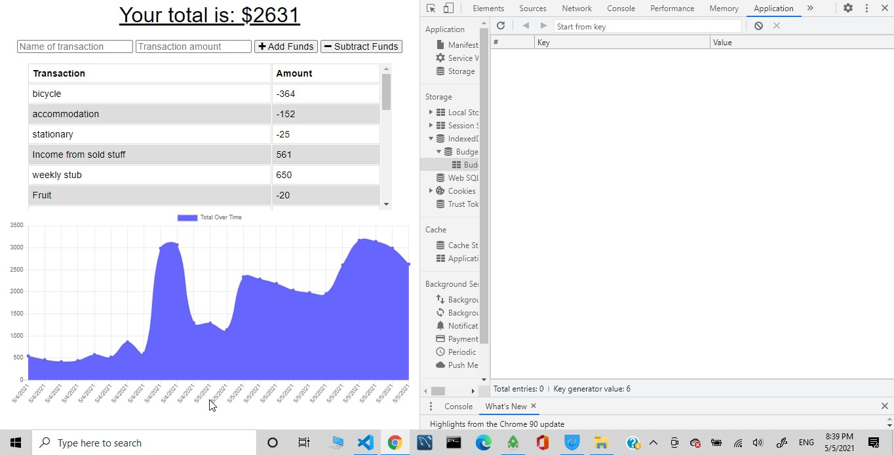
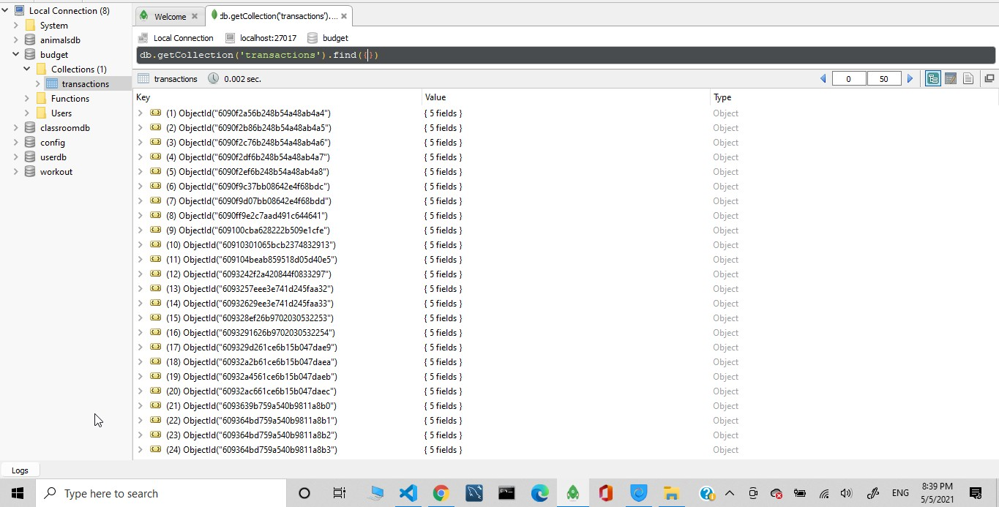
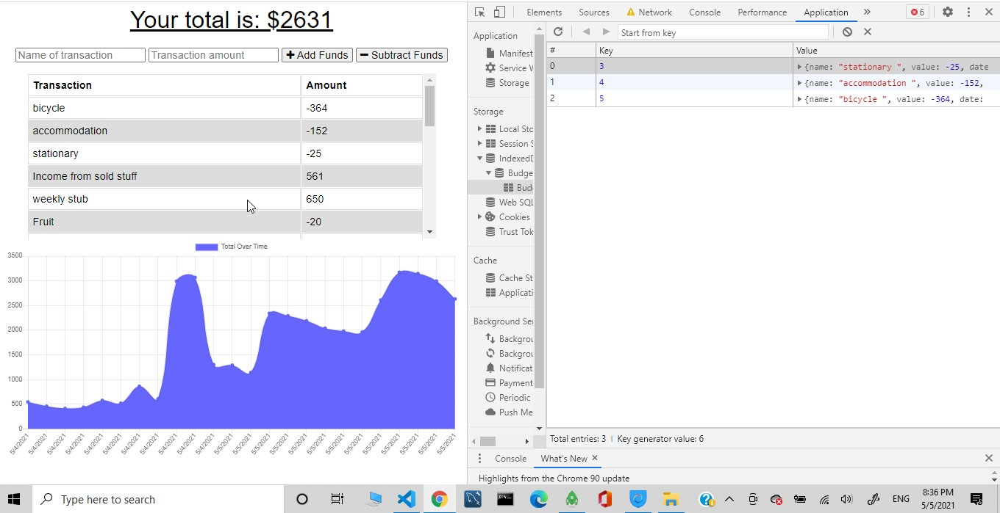
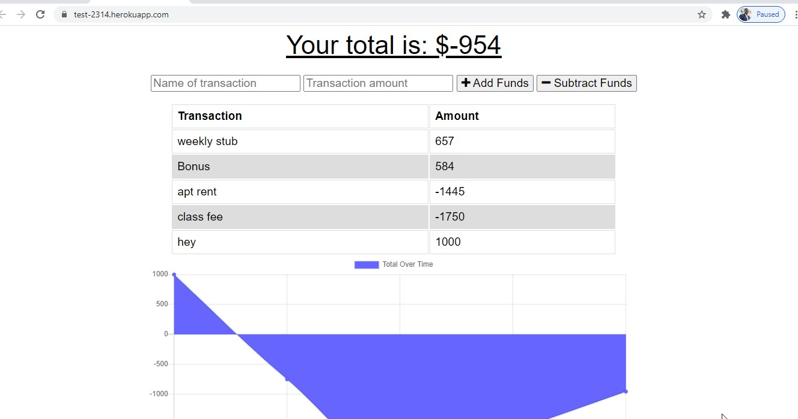
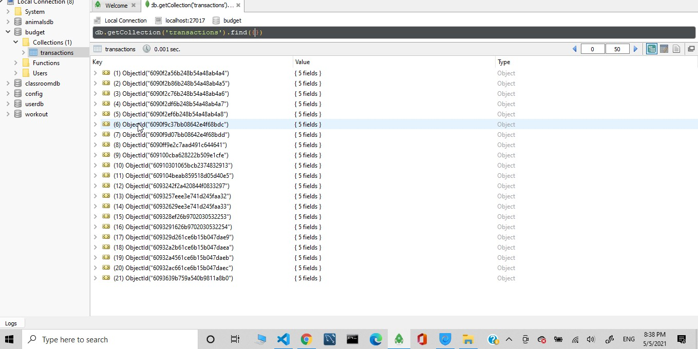

## License badge: ](https://opensource.org/licenses/ISC)

# Offline-Online-Budget-Tracker

## Table of Content
- [Description](#description)
- [Instructions](#instructions)
- [Usage](#usage)
- [Guidelines](#guidelines)
- [Test instruction](#test-instruction)
- [Lesson learned](#lesson)
- [Acknowledgement](#acknowledgement)
- [Question](#question)

## Description 

By using this application a user can add expenses or/and deposit to thier budget both online and offline. A starter code only let the users to add expence and deposit to thier budget only when they are online or only when there is a connection. So this app let the users able to track thier with drawals and deposits with or without interenet connection. 
The application designed for any one who want to use it. To develop this application I used diffrent technologies including indexdb, which called a transactional database system, Javascript, a software registry and software package manager and installer called Node Package Manager (npm), express, Mongo data base, Mongoose, node.js and other relevant node.js frameworks. 

## Instructions

If you interested you can use and start tracking your budget with or with out intenet connection. If you want to test the app first open the application by using localhost:3000 or by using a live url and make your internet connecion offline mode. Following that add inputs inside name of transation and transaction ammount placholders and press on the + or - buttons depending on your budget transaction. Next inspect your the devtol and click on application and then under indexDB you will find a budget file link. When you click on that you will see your transactions. Now turn on your connection and refresh your page and your mongodb. The previous transaction information you had inside indexDB will be posted on mongoDB.
If you face any problem or would like to reach me, you can find my contact in question section.

## Usage 

You do not have a limitation to use this application. As you see the license section at the top of this file it is open source to use, copy, modify, and/or distribute this app for any purpose. 

## Guidelines: 

Try to read and watch relevant materials, tutorials and practice, practice, ....!

## Test instruction 

I checked the application for many times, and it works well. If you want you can click on a deployed live URL and have a look on a few screen shots.
You can click on the following live URL:https://test-2314.herokuapp.com/

## Lesson-learned

I got some take away like how and when to use Mongo database, and additional mongodb syntaxes like aggregate and sum.

## Acknowledgement

My instructor, my tutor, online information providers like google, you tube and others.

## Question

If you have any questions you can reach me via E-mail: bayleyegn100@gmail.com

Here is a link to my Github profile: http://github.com/bayleyegn100
